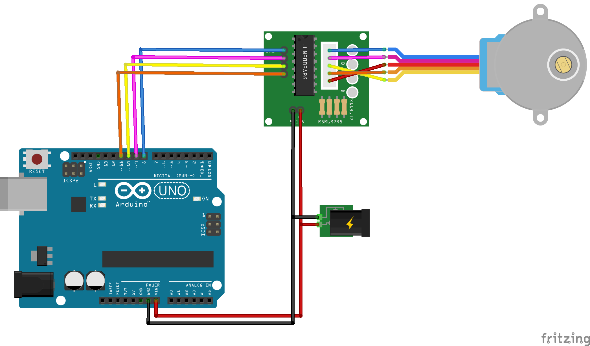

# EasyStepper Arduino Library
Lightweight Arduino library for stepper motors with ULN20003 and similar drivers. These little steppers are versitale and relatively powerful, 
and best of all easy to use!

This library aims to be as lightweight as possible, yet packed with all the essential features:
* Non-blocking moves
* Easy methods to move steps, degrees or full rotations
* Half step and full step mode (one-two phase on half step)
* RPM setting
* Adjustable for 6- or 8-pin drivers/steppers (or any other number for that matter)
* Auto-release to release hold current after a move

By default the library uses [one-two phase on half stepping](https://www.rs-online.com/designspark/stepper-motors-and-drives-what-is-full-step-half-step-and-microstepping), which is recommended for the 28BYJ-48. 


## Installation & Usage

### Installation
Install like any other Arduino library: download or clone this repository and add it to the Arduino Libraries folder.

### Wiring
The pins for the driver can be connected to any digital pin on the Arduino. Feed the 5V from an external source; 
the current draw is more than the Arduino can supply and it is likely to damage your Arduino if you try to.

Example wiring diagram:


### Methods
See an overview of the methods below. Since the moves are non-blocking, `run()` should be called in each iteration of `loop()`. It will automatically check if it actually needs to move the stepper.\
Please refer to the [examples](examples/) how to use the methods.

| Method | Description |
| --- | --- |
| `EasyStepper(pin1, pin2, pin3, pin4)` | Create the stepper object |
| `init()` | Initialise the stepper object |
| `run()` | Run the stepper |
| `setRPM(rpm)` | Set the RPM |
| `moveSteps(steps)` | Move by steps |
| `moveRevolutions(rotations)`| Move by full rotations |
| `moveDegrees(degrees)` | Move by degrees |
| `setFullStep(true/false)` | Enable/disable full step mode. Default is half step mode |
| `setSteps(steps per rotation)` | Adjust number of steps per rotation |
| `setAutoRelease(true/false)` | Set auto release to release hold current after move |
| `getStepsLeft()` | Returns number of steps left for the set move |
| `getRPM()` | Returns RPM set |
| `getStepTime()` | Returns microsecond delay between steps |
| `getStepsPerRotation()` | Returns steps per rotation |
| `getAutoRelease()` | Return auto release enabled/disabled |

### Default settings & considerations
The default setting is half stepping with 4096 steps per rotation at 10 rpm and auto-release disabled.

**Note:**\
Adjusting RPM, half step/full step or number of steps per rotation can be done mid-program as all related values are automatically updated.\
However, it \(currently\) does **\*not\*** affect the current move set \(stepsLeft\).

### Expanding number of pins
This library can be easily adapted to work with drivers with different pin numbers, like 2-, 6- or 8-pin drivers, since the sequence is generated mathmatically rather than being hard-coded.
- In `EasyStepper.h`:
  + `const uint8_t NPins = 4;` to the desired pin number.
  + Expand `EasyStepper(uint8_t pin1, uint8_t pin2, uint8_t pin3, uint8_t pin4);` with pin5-8 (or how many are desired)
- In `EasyStepper.cpp`:
  + Expand `EasyStepper::EasyStepper(uint8_t pin1, uint8_t pin2, uint8_t pin3, uint8_t pin4) : pins{pin1, pin2, pin3, pin4} { ... }` with pin5-8 (or how many desired)


## Changelog

* 2019-03-13 version 0.9.0
  * Pre-release

## Contributing

- Minor fixes of code and documentation: please submit a pull request.
- Larger changes or flaws in the code, please open an issue and we can discuss how to proceed.
- Adding features: please submit a pull request. Squash meaningless commits first, but be sensible!

## License

This project is licensed under the MIT License - see [license.txt](license.txt) for details.

## Acknowledgements
This library is loosely based on the [CheapStepper library](https://github.com/tyhenry/CheapStepper)


#### Keywords
Additional keywords for the library:
```Arduino Stepper library ULN2003 28BYJ-48 full-step half-step```
